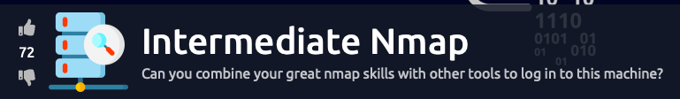
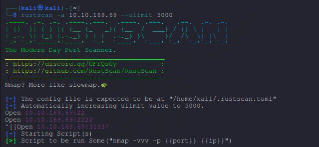
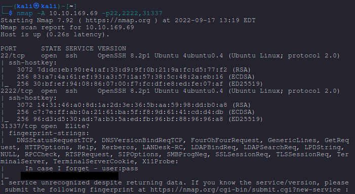
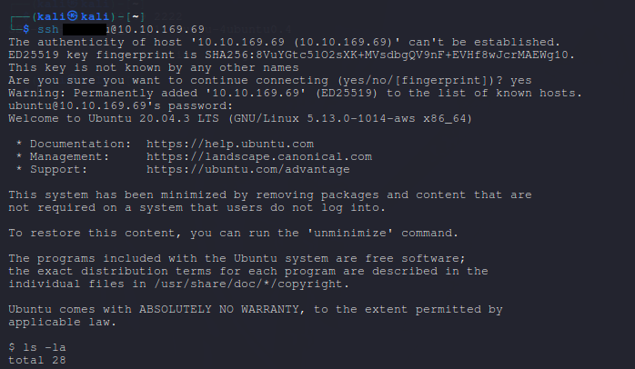

# writeup-IntermediateNmap
  

## Reconnisiance  
1. Starting with rustscan.  
  
it gave us a few ports so next i will try nmap agressive scan on these ports  

2. Nmap  
  
It gave us a username and password 😂  
well this was easy.  
Let's try to login with these credentials.  

3. SSH  
  
Wow, we are in.  
All that's left is to find the flag in user account and read it.

Done 😁